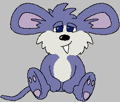

# Nezumi

[](https://github.com/inseven/nezumi/actions/workflows/build.yml)

The many incarnations of a small virtual mouse called Nezumi



So far, I've written incomplete implementations of my virtual pet Nezumi for the Psion Series 5, iPhone, Pebble, and a small Raspberry Pi based device. One of these days I might finish something. See https://jbmorley.co.uk/posts/2006-08-18-nezumi if you'd like a little more background.

The Raspberry Pi based device uses a Rust implementation of the Nezumi 'engine' and is under active development.

The wonderful artwork is done by my friend Mouse.

## Development

### Dependencies

Project development are managed using [mise](https://mise.jdx.dev). With mise installed, install dependencies by running
the following from anywhere in the project:

```sh
mise trust
mise install
```

In addition to this, there are some platform-wide dependencies. Install these as follows:

```sh
scripts/install-dependencies.sh
```
